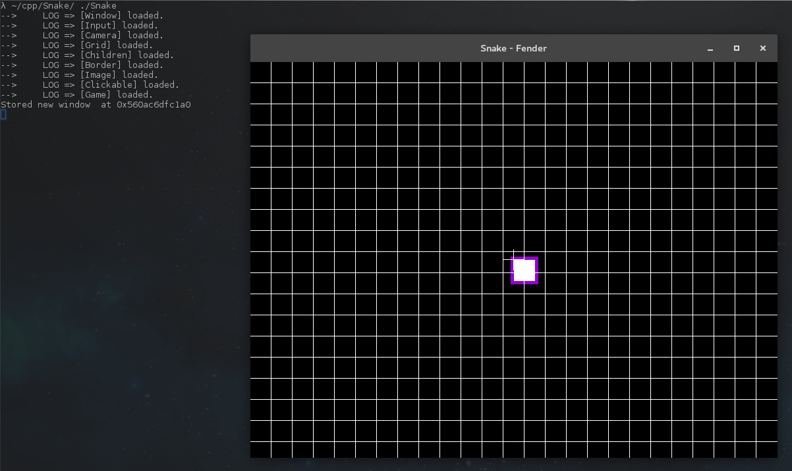

Creating gameObjects
====================

It's nice to have a Grid on the screen... but let's add gameObjects. Let's add a simple square for now.

Expected output
---------------

What is a GameObject ?
----------------------

.. code-block:: cpp
   :emphasize-lines: 4,7

   class GameObject : public futils::IEntity {
    public:
        GameObject() {
            attach<components::GameObject>();
            auto &transform = attach<components::Transform>();
            transform.position.z = 1;
            attach<components::AbsoluteTransform>();
            auto &border = attach<components::Border>();
            border.color = futils::Indianred;
            border.thickness = 2;
            border.visible = true;
        }
        ~GameObject() {
            detach<components::GameObject>();
            detach<components::Transform>();
            detach<components::AbsoluteTransform>();
        }
    };

A GameObject is an entity with a position and a border by default. It also has an AbsoluteTransform component, mostly used for rendering systems that the [Camera] will update.

.. rst-class:: fa fa-warning fa-2x

    > **You should not modify (AbsoluteTransform) yourself.**

Update [Game]
-------------

.. code-block:: cpp
   :emphasize-lines: 3,4,5,6,7,8,9,10,11,12,13,14,15,16, 23

   namespace Snake
   {
     class Block : public fender::entities::GameObject
     {
     public:
        Block()
        {
            auto &transform = get<fender::components::Transform>();
            transform.size.w = 1;
            transform.size.h = 1;
            auto &border = get<fender::components::Border>();
            border.thickness = 5;
            border.visible = true;
            border.color = futils::Darkviolet;
        }
     };

     class Game : public futils::ISystem
     {
        fender::entities::Window *myWindow{nullptr};
        fender::entities::World *myWorld{nullptr};
        fender::entities::Camera *myCamera{nullptr};
        Block *myBlock{nullptr};

        void init();
     public:
        Game() {
            name = "Game";
        }
        virtual ~Game() {}
        virtual void run(float);
     };
   }

And of course we'll simply create the entity in our init function :

``myBlock = &entityManager->create<Block>();``

**That's it !**. There's nothing more to do to output this gameObject. As you can see, creating it is enough, it will be displayed.

.. rst-class:: fa fa-trophy fa-2x

     This is almost everything you need to know to render anything on the screen. Read the documentation of the entities, components and system to know what you can do. Congratulations, you now know the basics !
