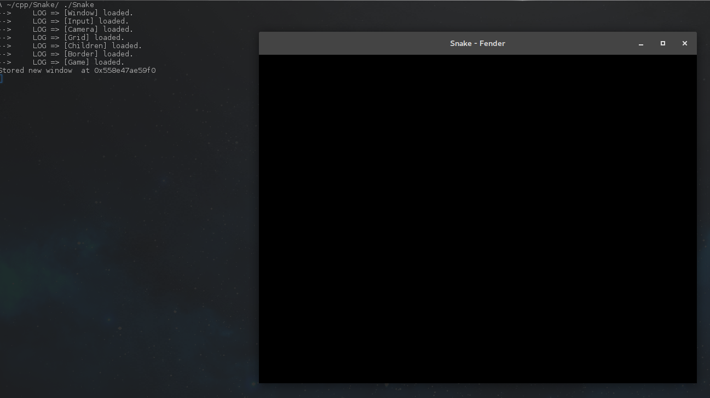

Opening a Window
================

Now that you know the basics (**creating and adding a system**, **sending and receiving events**), let's see what you can do with the engine.
Since this engine is targeted at developers, it requires you to create everything, starting with the window.

Expected result
---------------

Creating the game system
------------------------

Remember, we want to create a simple snake game. We're gonna create a Game system.

.. code-block:: cpp

   # include "fender.hpp"
   # include "events.hpp"
   # include "Entities/Window.hpp"

   class Game : public futils::ISystem
   {
                fender::entities::Window *myWindow{nullptr};
                void init();
   public:
                Game() = default;
                void run(float) final;
   }

   void Game::run(float)
   {
     static int phase = 0;
     switch(phase) {
       case 0:
                phase = 1;
                return init();
       case 1:
                return ;
     }
   }

   void Game::init()
   {
     myWindow = &entityManager->create<fender::entities::Window>();
     auto &winComponent = myWindow->get<fender::components::Window>();
     if (!winComponent.isOpen) {
       winComponent.visible = true;
       winComponent.title = "Snake - Fender";
       winComponent.size.w = 800; // in px
       winComponent.size.h = 600; // in px
     }
     addReaction<fender::events::Shutdown>([this](futils::IMediatorPacket &)
     {
       this->entityManager->removeSystem(this->name);
     });
   };

Let's take some time to understand this bit of code. First, you should know that if you compile and run, it will only open a window and display a black background.
But it's a start !

.. code-block:: cpp

   fender::entities::Window *myWindow{nullptr};

I'm holding a **pointer** to entity because I need to **create** the entity with the **entityManager**.

.. code-block:: cpp
   :emphasize-lines: 3,4

   void Game::run(float)
   {
     static int phase = 0;
     switch(phase) {
       case 0:
                phase = 1;
                return init();
       case 1:
                return ;
     }
   }

I'm using a static int to switch **states** : i'll initialize once and then forever just return. You are not forced to have an ``init`` function, but its often required (if only for event reactions).

Window init
-----------

.. code-block:: cpp
   :emphasize-lines: 3

   void Game::init()
   {
     myWindow = &entityManager->create<fender::entities::Window>();

Here, you can see that I create my window using ``entityManager->create<fender::entitied::Window>()``. Note that i'll take the **address of the reference** because i'm storing a pointer.
You **cannot** have a reference as class member, because that would require initializing it in the init-list, and you **cannot** do that because entityManager is **nullptr**.

.. code-block:: cpp
   :emphasize-lines: 4

   void Game::init()
   {
     myWindow = &entityManager->create<fender::entities::Window>();
     auto &winComponent = myWindow->get<fender::components::Window>();

Note that i'm taking a reference to the component of myWindow of type ``<fender::components::Window>``.

.. rst-class:: fa fa-warning fa-2x

    > **Never take a copy of the component**. This is a **common** mistake. **Always** take a reference or pointer to it.

.. code-block:: cpp
   :emphasize-lines: 5,6,7,8,9,10

   void Game::init()
   {
     myWindow = &entityManager->create<fender::entities::Window>();
     auto &winComponent = myWindow.get<fender::components::Window>();
     if (!winComponent.isOpen) {
       winComponent.visible = true;
       winComponent.title = "Snake - Fender";
       winComponent.size.w = 800; // in px
       winComponent.size.h = 600; // in px
     }
     
If the window isn't open already, then i'll set **visible** to **true** (the system will know it must render this window) and set other self-explanatory variables.

